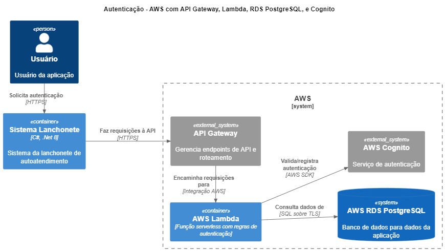
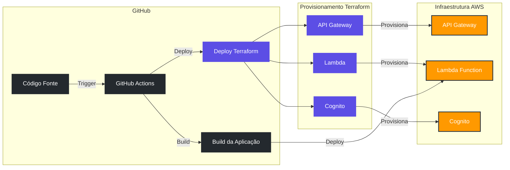

# Serviço de autenticação

Este repositório códigos fonte e scripts Terraform responsáveis por disponibilizar o serviço de autenticação do sistema de autoatendimento para uma lanchonete. Esse serviço foi construído para ser disponibilizado através de um AWS API Gateway que se integra com o serviço serveless AWS Lambda. A lamdba se integra com o serviço AWS RDS para validação de dados dos clientes e utiliza o AWS Cognito para complementar a validação no processo de autenticação.

A infra do API Gateway, AWS Cognito e as configurações de de rede e segurança necessárias para acesso são criadas através de scripts Terraform.

O provisionamento da infraestrutura, construção e implantação da função AWS Lambda é realizada através de através de workflows do GitHub Actions.

## Diagrama da Arquitetura




## Diagrama de Fluxo de CI/CD e Provisionamento



## Estrutura do Repositório

```
├── .github/
│   └── workflows/   # Workflows do GitHub Actions
├── src/             # Código da função AWS Lambda
├── terraform/       # Scripts Terraform
│   ├── congnito/    # Scripts Terraform responsáveis pela construção dos compontes do AWS Cognito
│   ├── lambda/      # Scripts Terraform responsáveis pela construção dos compontes do AWS Lambda, API Gateway e suas dependências
```

## Plugins do VSCode para Desenvolvimento

Para uma experiência de desenvolvimento mais produtiva com Terraform e AWS, recomendamos os seguintes plugins do VSCode:

- [HashiCorp Terraform](https://marketplace.visualstudio.com/items?itemName=HashiCorp.terraform)
- [Terraform doc snippets](https://marketplace.visualstudio.com/items?itemName=run-at-scale.terraform-doc-snippets): Snippets para documentação de módulos Terraform.
- [AWS Toolkit](https://marketplace.visualstudio.com/items?itemName=AmazonWebServices.aws-toolkit-vscode): Fornece integração com serviços AWS diretamente no VSCode.
- [GitLens](https://marketplace.visualstudio.com/items?itemName=eamodio.gitlens): Integração Git aprimorada com histórico de linha e navegação avançada.
- [YAML](https://marketplace.visualstudio.com/items?itemName=redhat.vscode-yaml): Suporte para arquivos YAML (útil para configurações do GitHub Actions).
- [GitHub Actions](https://marketplace.visualstudio.com/items?itemName=GitHub.vscode-github-actions): Suporte para sintaxe dos workflows do GitHub Actions.

## Pré-requisitos

Antes de executar os scripts Terraform localmente, certifique-se de ter instalado:

1. [Terraform](https://www.terraform.io/downloads.html) (versão 1.0.0 ou superior)
2. [AWS CLI](https://aws.amazon.com/cli/) configurado com as credenciais adequadas
3. [Git](https://git-scm.com/downloads)
4. [Mock Lambda Test Tool](https://aws.amazon.com/blogs/developer/debugging-net-core-aws-lambda-functions-using-the-aws-net-mock-lambda-test-tool/): ferramenta que permite fazer debug de funções AWS Lambda construídas em .Net Core.

## Configuração AWS

No arquivo `~./aws/credentials` defina as credenciais em profile customizado:

```
[default]
aws_access_key_id=
aws_secret_access_key=
aws_session_token=
```

Adicionei uma entrada no arquivo `~/.aws/config` para especificar a região padrão.

```
[profile default]
region = us-east-1
```

## Configuração do Backend S3

O estado do Terraform é armazenado em um bucket S3 para garantir consistência e colaboração entre a equipe. Para configurar o backend:

1. Conceda permissão ao arquivo setup.sh
   `chmod +x terraform/setup.sh`
2. Execute o script `setup.sh` para criar o bucket S3:

```bash
./terraform/setup.sh
```

Este script irá:

- Criar o bucket S3 para armazenar o estado do Terraform (caso não exista)
- Habilitar versionamento no bucket

## Execução Local dos Scripts Terraform

Para executar os scripts Terraform localmente, siga os passos abaixo:

### Pré-requisitos

- Os scripts dependem da VPC que é criada à partir do [repositório de infra](https://github.com/ronanluiz/fiap-tech-challenge-infra).
- A aplicação depende do banco de dados criado a partir do [repositório de banco de dados](https://github.com/ronanluiz/fiap-tech-challenge-bd).

### Inicialize o Terraform

```bash
# Para o Cognito
terraform -chdir=terraform/cognito init
# Para a Lambda
terraform -chdir=terraform/lambda init
```

Este comando inicializa o diretório de trabalho do Terraform, baixa os provedores necessários e configura o backend S3.

### Valide a configuração

```bash
# Para o Cognito
terraform -chdir=terraform/cognito validate
# Para a Lambda
terraform -chdir=terraform/lambda validate
```

Este comando verifica se a configuração está sintaticamente correta e internamente consistente.

### Formate os scripts

```bash
terraform -chdir=terraform fmt -recursive
```

Este comando organiza a formatação dos scripts nos arquivos padronizando principalmente a identação de código para deixá-lo mais legível.

### Crie um plano de execução

```bash
# Para o Cognito
terraform -chdir=terraform/cognito plan -out=tfplan
# Para a Lambda
terraform -chdir=terraform/lambda plan -out=tfplan
```

⚠ **Obs.:** Serão exigidas algumas informações como variáveis para execução dos scripts.

Este comando cria um plano de execução e salva no arquivo `tfplan`. Revise cuidadosamente as alterações propostas.

### Aplique as alterações

```bash
# Para o Cognito
terraform -chdir=terraform/cognito apply tfplan
# Para a Lambda
terraform -chdir=terraform/lambda apply tfplan

# Para execução automática se ter necessidade de aprovação
terraform -chdir=terraform/coginito apply tfplan -auto-approve
terraform -chdir=terraform/lambda apply tfplan -auto-approve
```

Este comando aplica as alterações planejadas na infraestrutura AWS.

### Destrua a infraestrutura (quando necessário)

```bash
# Para o Cognito
terraform -chdir=terraform/cognito destroy  
# Para a Lambda
terraform -chdir=terraform/lamdba destroy 
```

⚠ **Obs.:** Serão exigidas algumas informações como variáveis para execução dos scripts, porém, nesse processo não precisa preencher nada.

Este comando remove todos os recursos criados pelo Terraform. Use com cautela, apenas quando realmente necessário.

## Componentes da Infraestrutura

### AWS API Gateway

Serviço gerenciado para criar, publicar e proteger APIs, facilitando a comunicação entre aplicações e serviços da AWS.

### AWS Lambda

Serviço serverless que executa código em resposta a eventos, sem necessidade de gerenciamento de infraestrutura, cobrando apenas pelo tempo de execução.

### AWS Cognito

Serviço para autenticação e gerenciamento de usuários em aplicações, oferecendo registro, login e controle de acesso com integração a provedores de identidade.

### Security Groups

Os Security Groups controlam o tráfego de rede e permissões para os recursos AWS.

## GitHub Actions

Este repositório utiliza GitHub Actions para automatizar o processo de implantação da infraestrutura. Os workflows estão definidos em `.github/workflows/` e incluem:

- **build_lambda.yaml**: Responsável por fazer o build da função lambda e gerar o pacote para publicação.
- **cognito.yaml**: Responsável por provisionar os recursos do serviço AWS Cognito caso seja necessário através dos commandos terraform.
- **deploy_lambda.yaml**: Responsável por recuperar o pacote da aplicação lambda e provisionar os recursos do serviço AWS API Gateway e AWS Lamdba necessários para disponibilização da aplicação através dos commandos terraform.
- **main.yaml**: Responsável orquestrar a chamada os workflows para disponibilização da aplicação.

Abaixo a lista de variáveis/secrets que precisam ser configurados no github (Settings -> Secrets and variables -> Actions) para que a execução ocorra com sucesso:

**Secrets:**

- AWS_ACCESS_KEY_ID
- AWS_SECRET_ACCESS_KEY
- AWS_SESSION_TOKEN
- BD_HOST
- DB_NAME
- DB_USERNAME
- DB_PASSWORD
- JWT_SECRET: Secret necessária para geração do token JWT que será gerado como resultado do serviço de autenticação.

**Variables:**

- AWS_REGION

## Boas Práticas de Desenvolvimento

1. Sempre execute `terraform plan` antes de aplicar qualquer alteração
2. Mantenha o código modularizado para facilidade de manutenção
3. Use variáveis para valores que podem mudar entre ambientes
4. Adicione comentários para explicar configurações complexas
5. Faça commit de alterações pequenas e frequentes
6. Evite armazenar segredos no código (use variáveis de ambiente ou AWS Secrets Manager)

## Resolução de Problemas


| Problema                               | Possível Solução                                                                                                                                                                                                |
| ---------------------------------------- | -------------------------------------------------------------------------------------------------------------------------------------------------------------------------------------------------------------------- |
| Erro de acesso ao bucket S3            | Verifique suas credenciais AWS e permissões                                                                                                                                                                       |
| Conflito de estado                     | Verifique se outra pessoa está executando o Terraform simultaneamente ou se há necessidade de reconfigurar o estado (normalmente é resolvido utilizando o comando`terraform -chdir=terraform init -reconfigur`) |
| Falha no GitHub Actions                | Verifique os secrets configurados no repositório                                                                                                                                                                  |
| Falha ao realizar o`terraform destroy` | Verificar se não existe outro recurso criado que está referenciando um recurso criado através de scripts desse repositório.                                                                                    |

Para problemas mais complexos, consulte a documentação oficial do [Terraform](https://www.terraform.io/docs/index.html) e da [AWS](https://docs.aws.amazon.com/).
